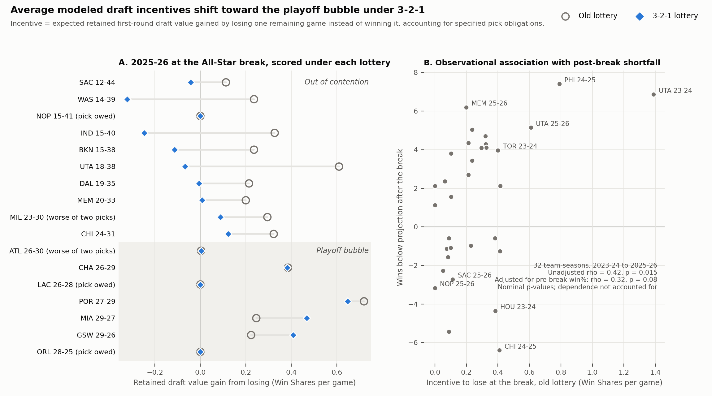

# Relegating the Tank

**Where does the NBA's 3-2-1 lottery move the incentive to lose?** This research model compares expected retained first-round draft value from losing versus winning one remaining regular-season game under the old and 3-2-1 rules.

**Main finding:** the modeled incentive falls for the weakest teams but rises near the play-in boundary. In historical retained-exposure cohorts, mean incentive changes from 0.30 to −0.003 Win Shares per game for 29 out-of-contention team-seasons and from 0.35 to 0.53 (+51%) for 18 bubble team-seasons. In two synthetic 2026–27 market scenarios, the bottom-eight mean falls 89–95%. These are rule counterfactuals, not causal evidence of intentional losing or forecasts of observed behavior; see [methods and caveats](docs/METHODS.md).

Read the [abstract](abstract.md), [two-page PDF](submission/ssac27-abstract.pdf), or [Table 1](results/table1.md). The PDF is a convenience rendering; submission format and page layout still need checking against the actual submission form.



## Quickstart

From the repository root, using CPython 3.13.7 on macOS arm64:

```sh
python3.13 -m venv .venv
.venv/bin/python -m pip install --require-hashes --only-binary=:all: -r requirements-release.lock
.venv/bin/python -I -B run_checks.py
.venv/bin/python -I -B reproduce.py
```

The default reproduction reads deposited results and `results/pick_values.csv`, generating headline numbers, Table 1, Figure 1 and conditional Monte Carlo error tables in `outputs/`. It does not rerun full-season simulations. Use `--output-dir outputs/my-run` for a separate destination or `--full` to run the expensive historical and prospective simulations before generating artifacts. Published `results/` is protected by the wrapper.

[Full reproduction instructions](docs/REPRODUCTION.md) explain checks, individual commands and dependencies: the hashed platform-specific lock, direct pins, and unvalidated broader minimums are different environment specifications.

## File map

| Location | Purpose |
|---|---|
| [abstract.md](abstract.md), [submission/](submission/) | Research summary and PDF |
| [results/](results/) | Deposited simulation results and paper artifacts |
| [data/](data/) | Derived historical games and dated market inputs |
| [reproduce.py](reproduce.py), [run_checks.py](run_checks.py) | Reproduction entry point and offline bounded checks |
| [replay.py](replay.py), [project_2026_27.py](project_2026_27.py) | Historical and synthetic prospective simulations |
| [sim.py](sim.py), [lottery.py](lottery.py), [ownership.py](ownership.py), [value.py](value.py) | Model, lottery rules, selected obligations and value curves |
| [docs/REPRODUCTION.md](docs/REPRODUCTION.md), [docs/METHODS.md](docs/METHODS.md) | Commands, settings and interpretation limits |
| [DATA_SOURCES.md](DATA_SOURCES.md), [DATA_NOTICE.md](DATA_NOTICE.md) | Provenance, dictionary and source-specific rights caveats |
| [docs/CLEANUP.md](docs/CLEANUP.md), [VALIDATION.md](VALIDATION.md) | Current cleanup checks and historical validation record |
| [tools/check_integrity.py](tools/check_integrity.py), [RELEASE_MANIFEST.json](RELEASE_MANIFEST.json), [SHA256SUMS](SHA256SUMS) | Payload inventory and byte-integrity verification |

Original code and documentation are [MIT licensed](LICENSE). Author authorization covers selected derived inputs and outputs, not a blanket license to third-party source material. Raw mirrors, provider captures, credentials and nonpublic research materials are excluded. The deposit does not imply conference acceptance or complete raw-source reconstruction. [Repository on GitHub](https://github.com/axel5o5/tank321).
